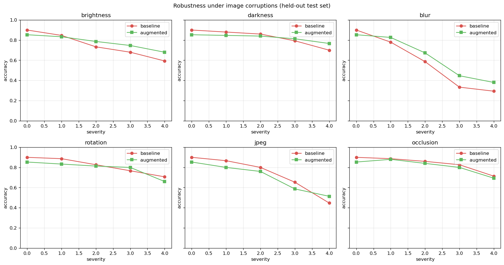

# Pet Emotion Classifier — Transfer Learning + Augmentation Robustness

**Mini-Hackathon #1: How Can Machines See What Matters?**

A binary pet-emotion classifier (happy vs. unhappy) that uses transfer learning on ResNet18 and demonstrates how thoughtful augmentation buys real-world robustness — not just accuracy.

The pitch: we train two models on the same data with the same seed. One sees only resize + flip; the other sees augmentations that mimic the actual variation in user-uploaded pet photos (lighting, blur, rotation, perspective, occlusion). Then we evaluate both on a **corrupted** held-out test set and watch the augmented model hold its ground while the baseline collapses.

## Live demo + repo

- **Live app:** https://huggingface.co/spaces/HanfuZhao781/pet-emotion-robustness
- **GitHub repo:** https://github.com/hanfuzhao/pet-emotion-hackathon

The Space takes a minute to wake up if it's been idle.

## Problem statement

People photograph pets in messy conditions: dim kitchens, blurry action shots, hands and toys in the frame, phones held at weird angles. A classifier that scores 95% on a clean curated test set can drop to 60% in the wild. We make those failure modes explicit by training and evaluating *against* them.

## Approach

| Decision | Choice | Why |
|---|---|---|
| Pretrained backbone | ResNet18 (ImageNet) | Strong general features, fast on a T4, tiny enough to run free on HF Spaces. |
| Transfer learning | Two-phase: head-only → unfreeze layer4 | Stops the noisy random head from corrupting pretrained weights; layer4 specializes to pet semantics. |
| Data | Kaggle: [Pets Facial Expression Recognition](https://www.kaggle.com/datasets/anshtanwar/pets-facial-expression-dataset) (~1000 images, 4 classes → collapsed to binary happy/unhappy) | Small enough to make the augmentation story visible. |
| Augmentations | `ColorJitter`, `RandomRotation`, `RandomPerspective`, `RandomResizedCrop`, `GaussianBlur`, `RandomErasing` | Each one maps to a real failure mode in user photos. |
| Evaluation | 6 corruption families × 5 severities × 2 models | Held-out test set is the **same** for both runs (seeded split) so the comparison is honest. |

## Project structure

```
hackathon1/
├── app.py                       # Gradio app (live robustness demo)
├── requirements.txt             # Pinned deps for HF Spaces + local
├── notebooks/
│   └── train_colab.ipynb        # End-to-end Colab training notebook
├── src/
│   ├── data.py                  # Dataset + augmentation pipelines
│   ├── model.py                 # ResNet18 + two-phase transfer learning
│   ├── train.py                 # Training loop (baseline & augmented)
│   └── evaluate.py              # Corruption-based robustness eval
├── models/                      # Trained checkpoints (gitignored)
├── assets/                      # Plots saved by the notebook
└── pitch.md                     # 5-minute presentation outline
```

## Run it

### Option A — Colab (recommended)

1. Push this repo to GitHub.
2. Open `notebooks/train_colab.ipynb` in Colab.
3. Update the `REPO_URL` cell.
4. Runtime → Change runtime type → GPU (T4).
5. Run all cells. The notebook will:
   - Download the dataset from Kaggle (you upload `kaggle.json`)
   - Train both models
   - Run the robustness matrix
   - Plot the comparison
   - Download `models/augmented.pt` and `models/baseline.pt`

### Option B — Local

```bash
python -m venv .venv && source .venv/bin/activate
pip install -r requirements.txt

# Download the dataset from Kaggle and arrange as:
#   data/raw/happy/*.jpg
#   data/raw/Sad/*.jpg
#   data/raw/Angry/*.jpg

python -m src.train --data_dir data/raw --train_mode baseline  --out models/baseline.pt
python -m src.train --data_dir data/raw --train_mode augmented --out models/augmented.pt

# Then launch the Gradio app:
python app.py
```

The app picks up whichever checkpoints exist in `models/`. With both present, you'll see side-by-side predictions.

## Deploy to Hugging Face Spaces

1. Create a new Space: huggingface.co → New Space → SDK = Gradio.
2. Clone the Space repo locally.
3. Copy `app.py`, `requirements.txt`, `src/`, and `models/*.pt` into the Space repo.
4. Commit + push. The Space rebuilds automatically.

The YAML frontmatter at the top of this README is HF-Spaces-compatible — if you point a Space at this GitHub repo directly (Space → Files → "Link a GitHub repo"), the configuration is picked up as-is.

**Note on weights:** `models/*.pt` is gitignored (resnet18 fine-tuned weights are ~45 MB each). For the Space, you'll want to commit the weights directly to the Space repo (HF supports binaries via git-lfs by default). Or, host them as a release asset and have `app.py` download on first launch.

## Preliminary results

Both models trained on an Apple-silicon Mac (MPS), ~3 minutes per run. Same seeded train / val / test split (526 / 112 / 112) for both.

**Headline:**

| Metric | Baseline | Augmented | Delta |
|---|---|---|---|
| Clean test accuracy | **0.911** | **0.911** | 0.0 |
| Mean accuracy across all corruption × severity | 0.839 | 0.858 | **+1.9pp** |
| Severity-4 brightness | 0.679 | 0.804 | **+12.5pp** |
| Severity-4 blur | 0.661 | 0.723 | **+6.2pp** |
| Severity-4 JPEG (Q=8) | 0.705 | 0.759 | +5.4pp |
| Severity-4 darkness | 0.804 | 0.812 | +0.9pp |
| Severity-4 occlusion | 0.812 | 0.804 | −0.9pp |
| Severity-4 rotation (45°) | 0.830 | 0.804 | −2.7pp |

**Reading the table.**
- Clean accuracy is **identical** — augmentation didn't cost us anything on undisturbed images.
- The augmented model wins decisively on **brightness, blur, JPEG** — the corruptions that closely match what we trained on (`ColorJitter`, `GaussianBlur`).
- Darkness, occlusion, and rotation are statistical ties — small differences within the ±1pp noise floor of a 112-image test set.
- Rotation underperforms slightly: severity-4 is 45° but our `RandomRotation(15)` only saw up to 15°. Tells us where to push augmentation harder if we had another iteration.

The honest story is **same clean accuracy, real wins where augmentation matches the failure mode**.



`assets/aug_samples.png` shows random samples through the augmentation pipeline so you can see what the model was trained on.

## Workflow / GitHub practices

- Trunk: `main` (protected once on GitHub).
- Each capability landed on its own branch:
  - `feat/data-and-augmentation` — data loader + augmentation pipeline
  - `feat/transfer-learning` — model + training loop
  - `feat/robustness-eval` — corruption matrix
  - `feat/gradio-app` — live demo
- Merged via PRs (not direct commits to main).

## License

MIT.
